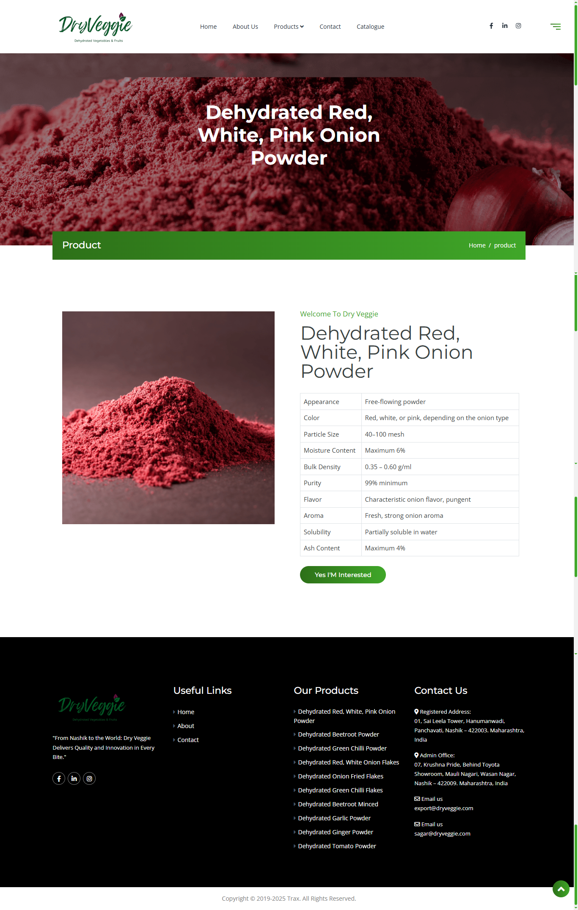

ght---

## Developer Contribution

As part of a company project, I recreated website pages based on an existing/legacy website design provided by the client.

### Responsibilities
- Recreated existing website pages using Bootstrap
- Matched layout and structure from the old design
- Ensured responsive behavior across devices
- Updated HTML and CSS as required

## 🎨 Design Overview

<table width="100%" border="0" cellspacing="0" cellpadding="20" style="background: #f8f9fa; border-radius: 10px;">
  <tr>
    <td width="50%" valign="top" style="padding: 15px;">
      

        
        
<strong>Home Page</strong>

      

    </td>
    <td width="50%" valign="top" style="padding: 15px;">
      

        
        
<strong>Single Product Page</strong>

      

    </td>
  </tr>
</table>

  

